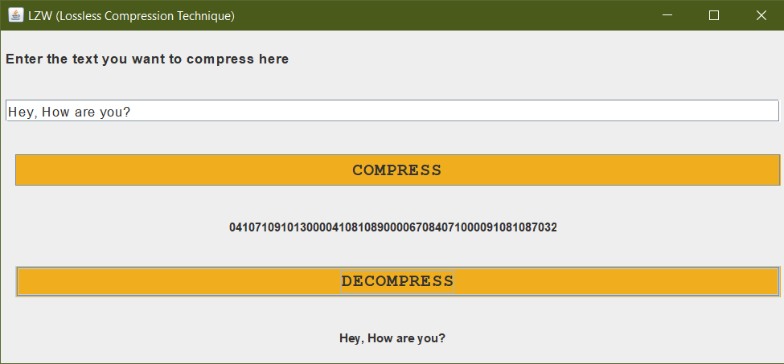

# LZW (Lossless Compression Technique)

# **Summary:**

This small program makes use of one of the important text compression algorithms, **LZW**. It&#39;s used to encode ASCII Characters into compressed format with **a small size** , then you can **decode** the text again whenever you want into a readable format.

The program has **two options**. It can take the **text file name** from the user by running the main function in the file **LZW.java** then the compressed text will be in a file named **compressed.txt** , or you can run the **GUI app** from the file **GUI.java** and enter the text you want as in the following picture.

 
You can find more infromation for **how this algorithm works** at this **PDF** : [http://www.learngroup.org/uploads/2015-10-27/Intro,\_LZ77,\_LZ\_78,\_LZW\_Leangroup\_org.pdf](http://www.learngroup.org/uploads/2015-10-27/Intro,_LZ77,_LZ_78,_LZW_Leangroup_org.pdf) starting from **page 79**.

The project is built using **Java, IntelliJ.**
